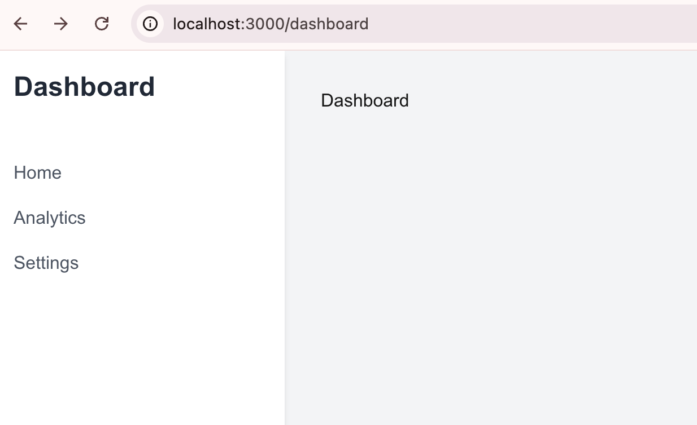

### Add a Dashboard page/route to the app. 


```typescript
├── src
│   ├── app
│   │   ├── dashboard
│   │       ├── layout.tsx
│   │       ├── page.tsx
│   ├── fonts
│   ├── favicon.ico
│   ├── globals.css
│   ├── layout.tsx
│   ├── page.tsx
```

Dashboard landing page. 

```typescript
// src/app/dashboard/page.tsx
export default function Dashboard() {
    return (
        <div>
            Dashboard
        </div>
    )
}
```

Dashboard layout.tsx page. 

```typescript
// src/app/dashboard/layout.tsx
import React from 'react'
import Link from 'next/link'

export default function DashboardLayout({
                                            children,
                                        }: {
    children: React.ReactNode
}) {
    return (
        <div className="flex h-screen bg-gray-100">
            {/* Sidebar */}
            <aside className="w-64 bg-white shadow-md">
    <div className="p-4">
    <h1 className="text-2xl font-bold text-gray-800">Dashboard</h1>
        </div>
        <nav className="mt-6">
    <Link href="/dashboard" className="block py-2 px-4 text-gray-600 hover:bg-gray-200">
        Home
        </Link>
        <Link href="/dashboard/analytics" className="block py-2 px-4 text-gray-600 hover:bg-gray-200">
        Analytics
        </Link>
        <Link href="/dashboard/settings" className="block py-2 px-4 text-gray-600 hover:bg-gray-200">
        Settings
        </Link>
        </nav>
        </aside>

    {/* Main content */}
    <main className="flex-1 p-8">
        {children}
        </main>
        </div>
)
}
```
Your Dashboard link should look like this. 



Next, let's [put the Dashboard behind authenticaion](03-add-required-auth-to-the-dashboard.md)