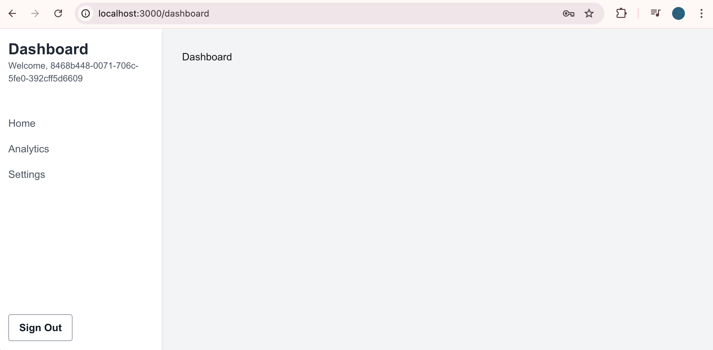

### Configure Amplify and Amplify Auth in your Next.js app

We're going to modify the `dashboard/layout.tsx` page so the Dashboard and sub-pages require authenticated access.

```typescript
//dasbhoard/layout.tsx
'use client'

import React from 'react'
import Link from 'next/link'
import { useRouter } from 'next/navigation'
import { Amplify } from 'aws-amplify'
import { signOut } from '@aws-amplify/auth'
import { Authenticator, View, Button } from '@aws-amplify/ui-react'
import '@aws-amplify/ui-react/styles.css'
import awsExports from '../../aws-exports'

Amplify.configure(awsExports)

export default function DashboardLayout({
                                            children,
                                        }: {
    children: React.ReactNode
}) {
    const router = useRouter()

    async function handleSignOut() {
        try {
            await signOut()
            router.push('/')
        } catch (error) {
            console.error('Error signing out: ', error)
        }
    }

    return (
        <Authenticator>
            {({ signOut, user }) => (
        <View className="flex h-screen bg-gray-100">
            {/* Sidebar */}
            <aside className="w-64 bg-white shadow-md">
                <div className="p-4">
                    <h1 className="text-2xl font-bold text-gray-800">Dashboard</h1>
                    {user && <p className="text-sm text-gray-600">Welcome, {user.username}</p>}
                </div>
                <nav className="mt-6">
                    <Link href="/dashboard" className="block py-2 px-4 text-gray-600 hover:bg-gray-200">Home</Link>
                    <Link href="/dashboard/analytics" className="block py-2 px-4 text-gray-600 hover:bg-gray-200">Analytics</Link>
                    <Link href="/dashboard/settings" className="block py-2 px-4 text-gray-600 hover:bg-gray-200">Settings </Link>
                </nav>
                <div className="absolute bottom-0 w-64 p-4">
                    <Button onClick={handleSignOut} className="w-full py-2 px-4 bg-red-500 text-white rounded hover:bg-red-600 transition-colors">Sign Out</Button>
                </div>
            </aside>
        {/* Main content */}
        <main className="flex-1 p-8">
            {children} 
            </main>
            </View>
    )}
    </Authenticator>
   )
}
```

If all goes well, you should see: 


Go ahead and create an account. Now you should see this: 



Next, let's [create a file upload feature](04-add-upload-files-to-storage.md). 

