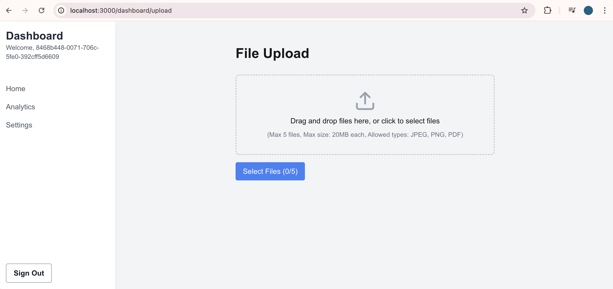

### Add an File Upload Feature

This will demonstrate how we can take advantage of Amplify Storage. First, let's add some packages. 

```bassh
npm i react-dropzone
```

```bassh
npm i lucide-react
```

Now let's create a basic file upload page. 

```typescript
//src/app/dashboard/upload/page.tsx
'use client'

import { useState, useCallback } from 'react'
import { useDropzone } from 'react-dropzone'
import { uploadData } from 'aws-amplify/storage'
import { Upload, X } from "lucide-react"

interface FileUploadStatus {
    file: File
    progress: number
    status: 'uploading' | 'completed' | 'error'
    cancelUpload: () => void
}

const MAX_FILE_SIZE = 20 * 1024 * 1024 // 20MB
const ALLOWED_FILE_TYPES = ['image/jpeg', 'image/png', 'application/pdf']
const MAX_ATTACHMENTS = 5

export default function FileUpload() {
    const [fileStatuses, setFileStatuses] = useState<FileUploadStatus[]>([])

    const showToast = (title: string, description: string, type: 'success' | 'error') => {
        alert(`${title}: ${description}`)
    }

    const onDrop = useCallback(async (acceptedFiles: File[]) => {
        const remainingSlots = MAX_ATTACHMENTS - fileStatuses.length
        const filesToUpload = acceptedFiles.slice(0, remainingSlots)

        if (acceptedFiles.length > remainingSlots) {
            showToast("Warning", `Only ${remainingSlots} file(s) can be added. The rest were ignored.`, 'error')
        }

        const newFileStatuses = filesToUpload.map(file => ({
            file,
            progress: 0,
            status: 'uploading' as const,
            cancelUpload: () => {}
        }))
        setFileStatuses(prev => [...prev, ...newFileStatuses])

        for (const fileStatus of newFileStatuses) {
            try {
                const { file } = fileStatus
                if (file.size > MAX_FILE_SIZE) {
                    throw new Error('File size exceeds 20MB limit')
                }
                if (!ALLOWED_FILE_TYPES.includes(file.type)) {
                    throw new Error('File type not allowed')
                }

                const { cancel, result } = uploadData({
                    key: file.name,
                    data: file,
                    options: {
                        onProgress: (progress) => {
                            if (progress.transferredBytes && progress.totalBytes) {
                                const percentCompleted = Math.round((progress.transferredBytes / progress.totalBytes) * 100)
                                setFileStatuses(prev => prev.map(status =>
                                    status.file === file ? { ...status, progress: percentCompleted } : status
                                ))
                            }
                        },
                    },
                })

                fileStatus.cancelUpload = () => {
                    cancel()
                    setFileStatuses(prev => prev.filter(status => status.file !== file))
                    showToast("Cancelled", `Upload of ${file.name} was cancelled.`, 'success')
                }

                await result

                setFileStatuses(prev => prev.map(status =>
                    status.file === file ? { ...status, status: 'completed' } : status
                ))

                showToast("Success", `${file.name} uploaded successfully.`, 'success')
            } catch (error) {
                console.error('Error uploading file:', error)
                setFileStatuses(prev => prev.map(status =>
                    status.file === fileStatus.file ? { ...status, status: 'error' } : status
                ))
                showToast("Error", `Failed to upload ${fileStatus.file.name}. ${error instanceof Error ? error.message : 'Please try again.'}`, 'error')
            }
        }
    }, [fileStatuses.length])

    const { getRootProps, getInputProps, isDragActive } = useDropzone({
        onDrop,
        disabled: fileStatuses.length >= MAX_ATTACHMENTS
    })

    return (
        <div style={{ maxWidth: '600px', margin: '0 auto', padding: '1rem' }}>
    <h1 style={{ fontSize: '1.875rem', fontWeight: 'bold', marginBottom: '1.5rem' }}>File Upload</h1>
    <div
    {...getRootProps()}
    style={{
        border: '2px dashed #ccc',
            borderRadius: '0.5rem',
            padding: '2rem',
            textAlign: 'center',
            cursor: fileStatuses.length >= MAX_ATTACHMENTS ? 'not-allowed' : 'pointer',
            backgroundColor: isDragActive ? '#f0f9ff' : 'transparent',
            opacity: fileStatuses.length >= MAX_ATTACHMENTS ? 0.5 : 1
    }}
>
    <input {...getInputProps()} />
    <div style={{ display: 'flex', flexDirection: 'column', alignItems: 'center' }}>
    <Upload style={{ width: '3rem', height: '3rem', color: '#9ca3af', marginBottom: '0.5rem' }} />
    <p>{fileStatuses.length >= MAX_ATTACHMENTS ? 'Maximum number of files reached' : 'Drag and drop files here, or click to select files'}</p>
    <p style={{ fontSize: '0.875rem', color: '#6b7280', marginTop: '0.5rem' }}>
    (Max 5 files, Max size: 20MB each, Allowed types: JPEG, PNG, PDF)
    </p>
    </div>
    </div>
    <button
    onClick={() => document.querySelector('input')?.click()}
    style={{
        marginTop: '1rem',
            padding: '0.5rem 1rem',
            backgroundColor: fileStatuses.length >= MAX_ATTACHMENTS ? '#9ca3af' : '#3b82f6',
            color: 'white',
            border: 'none',
            borderRadius: '0.25rem',
            cursor: fileStatuses.length >= MAX_ATTACHMENTS ? 'not-allowed' : 'pointer'
    }}
    disabled={fileStatuses.length >= MAX_ATTACHMENTS}
        >
        Select Files ({fileStatuses.length}/{MAX_ATTACHMENTS})
    </button>
    {fileStatuses.length > 0 && (
        <div style={{ marginTop: '2rem' }}>
        <h2 style={{ fontSize: '1.25rem', fontWeight: '600', marginBottom: '1rem' }}>Upload Progress</h2>
        {fileStatuses.map((status, index) => (
            <div key={index} style={{ marginBottom: '1rem', padding: '1rem', border: '1px solid #e5e7eb', borderRadius: '0.5rem' }}>
            <div style={{ display: 'flex', justifyContent: 'space-between', alignItems: 'center', marginBottom: '0.5rem' }}>
            <span style={{ fontWeight: '500' }}>{status.file.name}</span>
            {status.status === 'uploading' && (
                <button
                    onClick={status.cancelUpload}
                style={{
                background: 'none',
                    border: 'none',
                    cursor: 'pointer',
                    padding: '0.25rem'
            }}
            >
                <X style={{ width: '1rem', height: '1rem' }} />
            </button>
            )}
            </div>
            <div style={{ width: '100%', height: '0.5rem', backgroundColor: '#e5e7eb', borderRadius: '0.25rem', overflow: 'hidden' }}>
            <div
                style={{
            width: `${status.progress}%`,
                height: '100%',
                backgroundColor: status.status === 'completed' ? '#10b981' : status.status === 'error' ? '#ef4444' : '#3b82f6',
                transition: 'width 0.3s ease-in-out'
        }}
            />
            </div>
            <span style={{ fontSize: '0.875rem', color: '#6b7280' }}>
            {status.status === 'completed'
                ? 'Completed'
                : status.status === 'error'
                    ? 'Error'
                    : `${status.progress}%`}
            </span>
            </div>
        ))}
        </div>
    )}
    </div>
)
}
```

Your File Upload page should look like this.



Go ahead and add images. 

Next, let's [read the images from S3](05-add-image-gallery.md)
