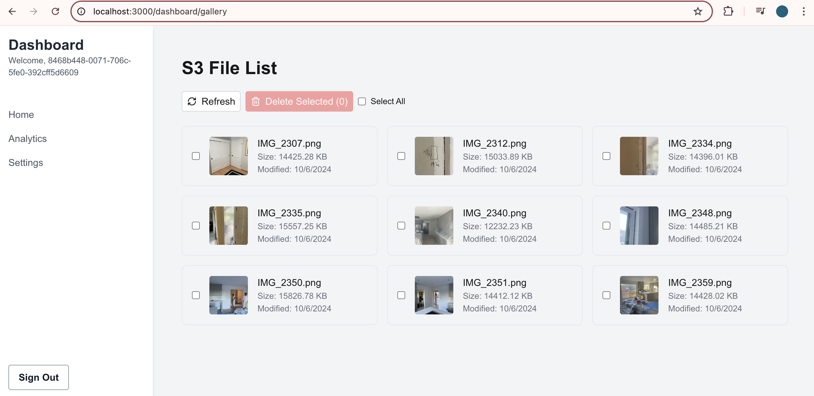

### Add an An Image Gallery

This will demonstrate how to pull images from storage and display with Amplify tools. 

#### AWS S3 Update
First, we need to update a few things in AWS S3. Go to you AWS Management Console. Then
1. Go to S3
2. Go to your application's bucket.
3. Go to the properties tab.
4. Find 'Static website hosting' and enable it.

#### Config NextJS to pull from a remote service
Second, we need to let our NextJS app know where we can serve images from. 

```javascript
//<root>/next.config.mjs
/** @type {import('next').NextConfig} */
const nextConfig = {
    reactStrictMode: true,
    images: {

        remotePatterns: [
            {
                protocol: 'https',
                hostname: 'your-long-bucket-name-here-dev.s3.us-east-1.amazonaws.com',
                pathname: '**',
            },
        ],
    }
};

export default nextConfig;
```


#### Add a photo gallery page. 

```typescript
//src/app/dashboard/gallery/page.tsx
'use client'

import { useState, useEffect, useCallback, useRef } from 'react'
import { list, getUrl, remove } from 'aws-amplify/storage'
import Image from 'next/image'
import { Loader2, File, RefreshCw, Image as ImageIcon, Trash2, X, ChevronLeft, ChevronRight } from "lucide-react"

interface S3File {
    key: string
    size: number
    lastModified: Date
    isImage: boolean
    url?: string
}

const imageExtensions = ['jpg', 'jpeg', 'png', 'gif', 'bmp', 'webp']

export default function S3FileList() {
    const [files, setFiles] = useState<S3File[]>([])
    const [selectedFiles, setSelectedFiles] = useState<Set<string>>(new Set())
    const [loading, setLoading] = useState(true)
    const [deleting, setDeleting] = useState(false)
    const [modalImage, setModalImage] = useState<string | null>(null)
    const toastRef = useRef<(message: string) => void>(() => {})

    const showToast = (message: string) => {
        alert(message) // Simple alert for demonstration. Replace with a more sophisticated toast in production.
    }

    useEffect(() => {
        toastRef.current = showToast
    }, [])

    const fetchFiles = useCallback(async () => {
        try {
            setLoading(true)
            const result = await list({
                prefix: '',
                options: {
                    listAll: true
                }
            })
            const filePromises = result.items.map(async item => {
                const extension = item.key.split('.').pop()?.toLowerCase() || ''
                const isImage = imageExtensions.includes(extension)
                let url
                if (isImage) {
                    const urlResult = await getUrl({ key: item.key })
                    url = urlResult.url.toString()
                }
                return {
                    key: item.key,
                    size: item.size ?? 0,
                    lastModified: item.lastModified ? new Date(item.lastModified) : new Date(),
                    isImage,
                    url
                }
            })
            const fileList = await Promise.all(filePromises)
            setFiles(fileList)
        } catch (error) {
            console.error('Error fetching files:', error)
            toastRef.current("Failed to load files. Please try again later.")
        } finally {
            setLoading(false)
        }
    }, [])

    useEffect(() => {
        fetchFiles()
    }, [fetchFiles])

    const toggleFileSelection = (key: string) => {
        setSelectedFiles(prev => {
            const newSet = new Set(prev)
            if (newSet.has(key)) {
                newSet.delete(key)
            } else {
                newSet.add(key)
            }
            return newSet
        })
    }

    const toggleSelectAll = () => {
        if (selectedFiles.size === files.length) {
            setSelectedFiles(new Set())
        } else {
            setSelectedFiles(new Set(files.map(file => file.key)))
        }
    }

    const deleteSelectedFiles = async () => {
        setDeleting(true)
        try {
            const selectedFilesArray = Array.from(selectedFiles)
            for (const key of selectedFilesArray) {
                await remove({ key })
            }
            toastRef.current(`Deleted ${selectedFiles.size} file(s) successfully.`)
            setSelectedFiles(new Set())
            await fetchFiles()
        } catch (error) {
            console.error('Error deleting files:', error)
            toastRef.current("Failed to delete some files. Please try again.")
        } finally {
            setDeleting(false)
        }
    }

    const ImageThumbnail = ({ file, onClick }: { file: S3File; onClick: () => void }) => {
        if (!file.url) {
            return <ImageIcon style={{ height: '32px', width: '32px', color: '#9ca3af' }} />
        }

        return (
            <div style={{ position: 'relative', width: '64px', height: '64px', cursor: 'pointer' }} onClick={onClick}>
        <Image
            src={file.url}
        alt={file.key}
        fill
        sizes="64px"
        style={{ borderRadius: '4px', objectFit: 'cover' }}
        />
        </div>
    )
    }

    const openImageModal = (url: string) => {
        setModalImage(url)
    }

    const closeImageModal = () => {
        setModalImage(null)
    }

    const navigateImage = (direction: 'prev' | 'next') => {
        const imageFiles = files.filter(file => file.isImage && file.url)
        const currentIndex = imageFiles.findIndex(file => file.url === modalImage)
        let newIndex

        if (direction === 'prev') {
            newIndex = (currentIndex - 1 + imageFiles.length) % imageFiles.length
        } else {
            newIndex = (currentIndex + 1) % imageFiles.length
        }

        setModalImage(imageFiles[newIndex].url || null)
    }

    if (loading) {
        return (
            <div style={{ display: 'flex', justifyContent: 'center', alignItems: 'center', height: '100vh' }}>
        <Loader2 style={{ height: '32px', width: '32px', animation: 'spin 1s linear infinite' }} />
        </div>
    )
    }

    return (
        <div style={{ maxWidth: '1200px', margin: '0 auto', padding: '16px' }}>
    <div style={{ display: 'flex', flexDirection: 'column', gap: '16px', marginBottom: '24px' }}>
    <h1 style={{ fontSize: '1.875rem', fontWeight: 'bold' }}>S3 File List</h1>
    <div style={{ display: 'flex', flexWrap: 'wrap', gap: '8px' }}>
    <button
        onClick={fetchFiles}
    style={{
        display: 'flex',
            alignItems: 'center',
            padding: '4px 8px',
            border: '1px solid #d1d5db',
            borderRadius: '4px',
            backgroundColor: 'white',
            cursor: 'pointer'
    }}
>
    <RefreshCw style={{ height: '16px', width: '16px', marginRight: '8px' }} />
    Refresh
    </button>
    <button
    onClick={deleteSelectedFiles}
    disabled={selectedFiles.size === 0 || deleting}
    style={{
        display: 'flex',
            alignItems: 'center',
            padding: '4px 8px',
            border: '1px solid #ef4444',
            borderRadius: '4px',
            backgroundColor: '#ef4444',
            color: 'white',
            cursor: selectedFiles.size === 0 || deleting ? 'not-allowed' : 'pointer',
            opacity: selectedFiles.size === 0 || deleting ? 0.5 : 1
    }}
>
    <Trash2 style={{ height: '16px', width: '16px', marginRight: '8px' }} />
    Delete Selected ({selectedFiles.size})
    </button>
    <div style={{ display: 'flex', alignItems: 'center', gap: '8px' }}>
    <input
        type="checkbox"
    id="select-all"
    checked={selectedFiles.size === files.length}
    onChange={toggleSelectAll}
    />
    <label htmlFor="select-all" style={{ fontSize: '0.875rem', fontWeight: 500 }}>
    Select All
    </label>
    </div>
    </div>
    </div>
    <div style={{ display: 'grid', gridTemplateColumns: 'repeat(auto-fill, minmax(300px, 1fr))', gap: '16px' }}>
    {files.map((file) => (
        <div
            key={file.key}
        style={{
        border: `1px solid ${selectedFiles.has(file.key) ? '#3b82f6' : '#e5e7eb'}`,
            borderRadius: '8px',
            padding: '16px'
    }}
    >
        <div style={{ display: 'flex', alignItems: 'center' }}>
        <input
            type="checkbox"
        checked={selectedFiles.has(file.key)}
        onChange={() => toggleFileSelection(file.key)}
        style={{ marginRight: '16px' }}
        />
        <div style={{ marginRight: '16px' }}>
        {file.isImage && file.url ? (
            <ImageThumbnail file={file} onClick={() => openImageModal(file.url!)} />
        ) : (
            <div style={{ width: '64px', height: '64px', backgroundColor: '#f3f4f6', borderRadius: '4px', display: 'flex', alignItems: 'center', justifyContent: 'center' }}>
            <File style={{ height: '32px', width: '32px', color: '#3b82f6' }} />
        </div>
        )}
        </div>
        <div>
        <p style={{ fontWeight: 500, overflow: 'hidden', textOverflow: 'ellipsis', whiteSpace: 'nowrap' }}>{file.key}</p>
    <p style={{ fontSize: '0.875rem', color: '#6b7280' }}>
        Size: {(file.size / 1024).toFixed(2)} KB
    </p>
    <p style={{ fontSize: '0.875rem', color: '#6b7280' }}>
        Modified: {file.lastModified.toLocaleDateString()}
        </p>
        </div>
        </div>
        </div>
    ))}
    </div>
    {files.length === 0 && !loading && (
        <p style={{ textAlign: 'center', color: '#6b7280', marginTop: '32px' }}>No files found in the S3 bucket.</p>
    )}

    {modalImage && (
        <div style={{
        position: 'fixed',
            inset: 0,
            backgroundColor: 'rgba(0, 0, 0, 0.5)',
            display: 'flex',
            alignItems: 'center',
            justifyContent: 'center',
            zIndex: 50
    }}>
        <div style={{ position: 'relative', maxWidth: '56rem', maxHeight: '100%' }}>
        <button
            style={{
        position: 'absolute',
            top: '8px',
            right: '8px',
            backgroundColor: 'transparent',
            border: 'none',
            color: 'white',
            cursor: 'pointer'
    }}
        onClick={closeImageModal}
        >
        <X style={{ height: '24px', width: '24px' }} />
    </button>
    <Image
        src={modalImage}
        alt="Full size image"
        width={800}
        height={600}
        style={{ maxWidth: '100%', maxHeight: '90vh', objectFit: 'contain' }}
        />
        <button
        style={{
        position: 'absolute',
            top: '50%',
            left: '8px',
            backgroundColor: 'transparent',
            border: 'none',
            color: 'white',
            cursor: 'pointer'
    }}
        onClick={() => navigateImage('prev')}
    >
        <ChevronLeft style={{ height: '32px', width: '32px' }} />
    </button>
    <button
        style={{
        position: 'absolute',
            top: '50%',
            right: '8px',
            backgroundColor: 'transparent',
            border: 'none',
            color: 'white',
            cursor: 'pointer'
    }}
        onClick={() => navigateImage('next')}
    >
        <ChevronRight style={{ height: '32px', width: '32px' }} />
    </button>
    </div>
    </div>
    )}
    </div>
)
}
```

Your Image Gallery page should look like this.



You should see the images you uploaded previously. 

Next, let's [add some data and grapql support](06-add-data-and-graphql.md)

