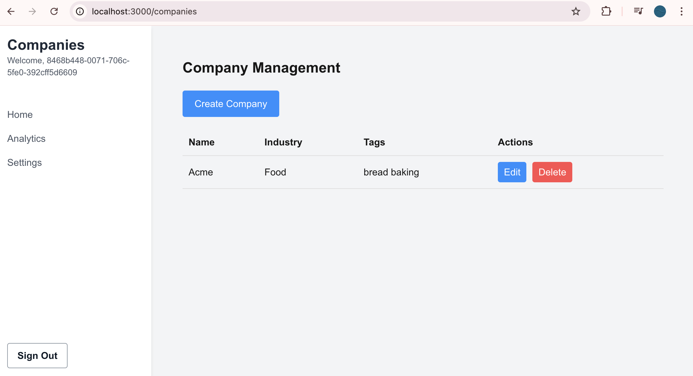

### Create a Company Page

We'll add a Company CRUD (create/read/update/delete) page, with it's own layout. 

#### Layout Page
```typescript
// src/app/companies/layout.tsx
'use client'

import React from 'react'
import Link from 'next/link'
import { useRouter } from 'next/navigation'
import { Amplify } from 'aws-amplify'
import { signOut } from '@aws-amplify/auth'
import { Authenticator, View, Button } from '@aws-amplify/ui-react'
import '@aws-amplify/ui-react/styles.css'
import awsExports from '../../aws-exports'

Amplify.configure(awsExports)

export default function DashboardLayout({
                                            children,
                                        }: {
    children: React.ReactNode
}) {
    const router = useRouter()

    async function handleSignOut() {
        try {
            await signOut()
            router.push('/')
        } catch (error) {
            console.error('Error signing out: ', error)
        }
    }

    return (
        <Authenticator>
            {({ signOut, user }) => (
                <View className="flex h-screen bg-gray-100">
                    {/* Sidebar */}
                    <aside className="w-64 bg-white shadow-md">
                        <div className="p-4">
                            <h1 className="text-2xl font-bold text-gray-800">Companies</h1>
                            {user && <p className="text-sm text-gray-600">Welcome, {user.username}</p>}
                        </div>
                        <nav className="mt-6">
                            <Link href="/dashboard" className="block py-2 px-4 text-gray-600 hover:bg-gray-200">
                                Home
                            </Link>
                            <Link href="/dashboard/analytics" className="block py-2 px-4 text-gray-600 hover:bg-gray-200">
                                Analytics
                            </Link>
                            <Link href="/dashboard/settings" className="block py-2 px-4 text-gray-600 hover:bg-gray-200">
                                Settings
                            </Link>
                        </nav>
                        <div className="absolute bottom-0 w-64 p-4">
                            <Button
                                onClick={handleSignOut}
                                className="w-full py-2 px-4 bg-red-500 text-white rounded hover:bg-red-600 transition-colors"
                            >
                                Sign Out
                            </Button>
                        </div>
                    </aside>

                    {/* Main content */}
                    <main className="flex-1 p-8">
                        {children}
                    </main>
                </View>
            )}
        </Authenticator>
    )
}
```

#### Company Page
```typescript
//src/app/companies/page.tsx
'use client'

import { useState, useEffect } from 'react'
import { generateClient } from 'aws-amplify/api'
import { listCompanies } from '@/graphql/queries'
import { createCompany, updateCompany, deleteCompany } from '@/graphql/mutations'
import { ListCompaniesQuery, CreateCompanyMutation, UpdateCompanyMutation, DeleteCompanyMutation } from '@/API'

const client = generateClient()

type Company = NonNullable<NonNullable<ListCompaniesQuery['listCompanies']>['items'][number]>

export default function CompanyManagement() {
    const [companies, setCompanies] = useState<Company[]>([])
    const [isLoading, setIsLoading] = useState(true)

    useEffect(() => {
        fetchCompanies()
    }, [])

    const fetchCompanies = async () => {
        setIsLoading(true)
        try {
            const result = await client.graphql<ListCompaniesQuery>({ query: listCompanies })
            const companiesData = result.data?.listCompanies?.items.filter((item): item is Company => item !== null) ?? []
            setCompanies(companiesData)
        } catch (error) {
            console.error('Error fetching companies:', error)
            alert('Failed to fetch companies')
        } finally {
            setIsLoading(false)
        }
    }

    const handleCreateCompany = async (name: string, description: string, industry: string, tags: string) => {
        try {
            const result = await client.graphql<CreateCompanyMutation>({
                query: createCompany,
                variables: {
                    input: {
                        name,
                        description,
                        industry,
                        tags: tags.split(',').map(tag => tag.trim()),
                    },
                },
            })
            const newCompany = result.data?.createCompany
            if (newCompany) {
                setCompanies([...companies, newCompany])
                alert('Company created successfully')
            }
        } catch (error) {
            console.error('Error creating company:', error)
            alert('Failed to create company')
        }
    }

    const handleUpdateCompany = async (id: string, name: string, description: string, industry: string, tags: string) => {
        try {
            const result = await client.graphql<UpdateCompanyMutation>({
                query: updateCompany,
                variables: {
                    input: {
                        id,
                        name,
                        description,
                        industry,
                        tags: tags.split(',').map(tag => tag.trim()),
                    },
                },
            })
            const updatedCompany = result.data?.updateCompany
            if (updatedCompany) {
                setCompanies(companies.map(company => company.id === id ? updatedCompany : company))
                alert('Company updated successfully')
            }
        } catch (error) {
            console.error('Error updating company:', error)
            alert('Failed to update company')
        }
    }

    const handleDeleteCompany = async (id: string) => {
        if (window.confirm('Are you sure you want to delete this company?')) {
            try {
                await client.graphql<DeleteCompanyMutation>({
                    query: deleteCompany,
                    variables: { input: { id } },
                })
                setCompanies(companies.filter(company => company.id !== id))
                alert('Company deleted successfully')
            } catch (error) {
                console.error('Error deleting company:', error)
                alert('Failed to delete company')
            }
        }
    }

    if (isLoading) return <div style={{ display: 'flex', justifyContent: 'center', alignItems: 'center', height: '100vh' }}>Loading...</div>

    return (
        <div style={{ maxWidth: '1200px', margin: '0 auto', padding: '20px' }}>
    <h1 style={{ fontSize: '24px', fontWeight: 'bold', marginBottom: '20px' }}>Company Management</h1>
    <CreateCompanyDialog onCreateCompany={handleCreateCompany} />
    <table style={{ width: '100%', borderCollapse: 'collapse' }}>
    <thead>
        <tr>
            <th style={{ textAlign: 'left', padding: '10px', borderBottom: '1px solid #ddd' }}>Name</th>
    <th style={{ textAlign: 'left', padding: '10px', borderBottom: '1px solid #ddd' }}>Industry</th>
    <th style={{ textAlign: 'left', padding: '10px', borderBottom: '1px solid #ddd' }}>Tags</th>
    <th style={{ textAlign: 'left', padding: '10px', borderBottom: '1px solid #ddd' }}>Actions</th>
    </tr>
    </thead>
    <tbody>
    {companies.map((company) => (
            <tr key={company.id}>
            <td style={{ padding: '10px', borderBottom: '1px solid #ddd' }}>{company.name}</td>
    <td style={{ padding: '10px', borderBottom: '1px solid #ddd' }}>{company.industry}</td>
    <td style={{ padding: '10px', borderBottom: '1px solid #ddd' }}>{company.tags?.join(', ')}</td>
    <td style={{ padding: '10px', borderBottom: '1px solid #ddd' }}>
    <UpdateCompanyDialog company={company} onUpdateCompany={handleUpdateCompany} />
    <button
    onClick={() => handleDeleteCompany(company.id)}
    style={{ marginLeft: '10px', padding: '5px 10px', backgroundColor: '#ff4d4f', color: 'white', border: 'none', borderRadius: '4px', cursor: 'pointer' }}
>
    Delete
    </button>
    </td>
    </tr>
))}
    </tbody>
    </table>
    </div>
)
}

function CreateCompanyDialog({ onCreateCompany }: { onCreateCompany: (name: string, description: string, industry: string, tags: string) => void }) {
    const [isOpen, setIsOpen] = useState(false)
    const [name, setName] = useState('')
    const [description, setDescription] = useState('')
    const [industry, setIndustry] = useState('')
    const [tags, setTags] = useState('')

    const handleSubmit = (e: React.FormEvent) => {
        e.preventDefault()
        onCreateCompany(name, description, industry, tags)
        setName('')
        setDescription('')
        setIndustry('')
        setTags('')
        setIsOpen(false)
    }

    if (!isOpen) {
        return (
            <button
                onClick={() => setIsOpen(true)}
        style={{ marginBottom: '20px', padding: '10px 20px', backgroundColor: '#1890ff', color: 'white', border: 'none', borderRadius: '4px', cursor: 'pointer' }}
    >
        Create Company
        </button>
    )
    }

    return (
        <div style={{ marginBottom: '20px', border: '1px solid #ddd', padding: '20px', borderRadius: '4px' }}>
    <h2 style={{ fontSize: '20px', marginBottom: '15px' }}>Create New Company</h2>
    <form onSubmit={handleSubmit}>
    <div style={{ marginBottom: '15px' }}>
    <label htmlFor="name" style={{ display: 'block', marginBottom: '5px' }}>Company Name</label>
    <input
    id="name"
    value={name}
    onChange={(e) => setName(e.target.value)}
    required
    style={{ width: '100%', padding: '5px', borderRadius: '4px', border: '1px solid #ddd' }}
    />
    </div>
    <div style={{ marginBottom: '15px' }}>
    <label htmlFor="description" style={{ display: 'block', marginBottom: '5px' }}>Description</label>
    <textarea
    id="description"
    value={description}
    onChange={(e) => setDescription(e.target.value)}
    style={{ width: '100%', padding: '5px', borderRadius: '4px', border: '1px solid #ddd' }}
    />
    </div>
    <div style={{ marginBottom: '15px' }}>
    <label htmlFor="industry" style={{ display: 'block', marginBottom: '5px' }}>Industry</label>
    <input
    id="industry"
    value={industry}
    onChange={(e) => setIndustry(e.target.value)}
    style={{ width: '100%', padding: '5px', borderRadius: '4px', border: '1px solid #ddd' }}
    />
    </div>
    <div style={{ marginBottom: '15px' }}>
    <label htmlFor="tags" style={{ display: 'block', marginBottom: '5px' }}>Tags (comma-separated)</label>
    <input
    id="tags"
    value={tags}
    onChange={(e) => setTags(e.target.value)}
    style={{ width: '100%', padding: '5px', borderRadius: '4px', border: '1px solid #ddd' }}
    />
    </div>
    <div>
    <button type="submit" style={{ padding: '10px 20px', backgroundColor: '#52c41a', color: 'white', border: 'none', borderRadius: '4px', cursor: 'pointer', marginRight: '10px' }}>Create</button>
    <button type="button" onClick={() => setIsOpen(false)} style={{ padding: '10px 20px', backgroundColor: '#f5f5f5', color: 'black', border: '1px solid #d9d9d9', borderRadius: '4px', cursor: 'pointer' }}>Cancel</button>
    </div>
    </form>
    </div>
)
}

function UpdateCompanyDialog({ company, onUpdateCompany }: { company: Company, onUpdateCompany: (id: string, name: string, description: string, industry: string, tags: string) => void }) {
    const [isOpen, setIsOpen] = useState(false)
    const [name, setName] = useState(company.name)
    const [description, setDescription] = useState(company.description ?? '')
    const [industry, setIndustry] = useState(company.industry ?? '')
    const [tags, setTags] = useState(company.tags?.join(', ') ?? '')

    const handleSubmit = (e: React.FormEvent) => {
        e.preventDefault()
        onUpdateCompany(company.id, name, description, industry, tags)
        setIsOpen(false)
    }

    if (!isOpen) {
        return (
            <button
                onClick={() => setIsOpen(true)}
        style={{ padding: '5px 10px', backgroundColor: '#1890ff', color: 'white', border: 'none', borderRadius: '4px', cursor: 'pointer' }}
    >
        Edit
        </button>
    )
    }

    return (
        <div style={{ position: 'fixed', top: 0, left: 0, width: '100%', height: '100%', backgroundColor: 'rgba(0,0,0,0.5)', display: 'flex', justifyContent: 'center', alignItems: 'center' }}>
    <div style={{ backgroundColor: 'white', padding: '20px', borderRadius: '4px', width: '80%', maxWidth: '500px' }}>
    <h2 style={{ fontSize: '20px', marginBottom: '15px' }}>Update Company</h2>
    <form onSubmit={handleSubmit}>
    <div style={{ marginBottom: '15px' }}>
    <label htmlFor="name" style={{ display: 'block', marginBottom: '5px' }}>Company Name</label>
    <input
    id="name"
    value={name}
    onChange={(e) => setName(e.target.value)}
    required
    style={{ width: '100%', padding: '5px', borderRadius: '4px', border: '1px solid #ddd' }}
    />
    </div>
    <div style={{ marginBottom: '15px' }}>
    <label htmlFor="description" style={{ display: 'block', marginBottom: '5px' }}>Description</label>
    <textarea
    id="description"
    value={description}
    onChange={(e) => setDescription(e.target.value)}
    style={{ width: '100%', padding: '5px', borderRadius: '4px', border: '1px solid #ddd' }}
    />
    </div>
    <div style={{ marginBottom: '15px' }}>
    <label htmlFor="industry" style={{ display: 'block', marginBottom: '5px' }}>Industry</label>
    <input
    id="industry"
    value={industry}
    onChange={(e) => setIndustry(e.target.value)}
    style={{ width: '100%', padding: '5px', borderRadius: '4px', border: '1px solid #ddd' }}
    />
    </div>
    <div style={{ marginBottom: '15px' }}>
    <label htmlFor="tags" style={{ display: 'block', marginBottom: '5px' }}>Tags (comma-separated)</label>
    <input
    id="tags"
    value={tags}
    onChange={(e) => setTags(e.target.value)}
    style={{ width: '100%', padding: '5px', borderRadius: '4px', border: '1px solid #ddd' }}
    />
    </div>
    <div>
    <button type="submit" style={{ padding: '10px 20px', backgroundColor: '#52c41a', color: 'white', border: 'none', borderRadius: '4px', cursor: 'pointer', marginRight: '10px' }}>Update</button>
    <button type="button" onClick={() => setIsOpen(false)} style={{ padding: '10px 20px', backgroundColor: '#f5f5f5', color: 'black', border: '1px solid #d9d9d9', borderRadius: '4px', cursor: 'pointer' }}>Cancel</button>
    </div>
    </form>
    </div>
    </div>
)
}
```

Your Company CRUD page should look like this.




That's it for now. Good luck. 
--end--

